<!--
  Profile README — lives in the repo arthawreliuk/arthawreliuk so GitHub
  renders it on the profile page. Widths 370/490 keep the portrait and info
  card the same height.
-->

<table>
<tr>
<td valign="top"></td>
<td valign="top"></td>
</tr>
</table>

## Arthur Hawreliuk

**Full Stack Developer · Front-end Specialist · React & Next.js**

 

<!-- animated contribution graph, refreshed daily by the workflow -->

